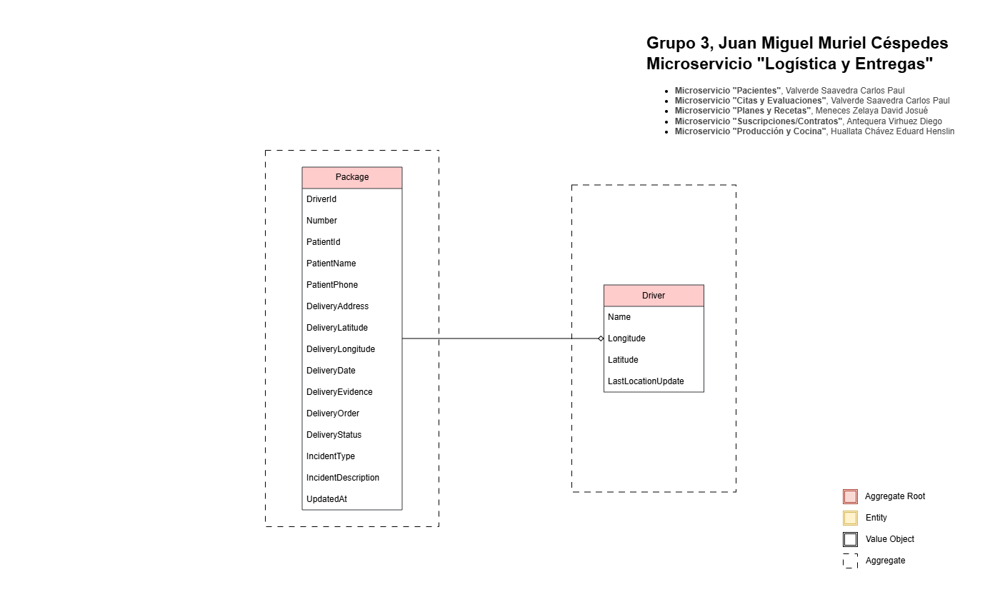

[](https://classroom.github.com/a/rVhxZd2x)

# Microservicio "Logística y Entregas"

Microservicio para gestionar operaciones de reparto (entregas) de paquetes alimenticios. Modela el ciclo de vida de un paquete, la actividad de repartidores y su planificación de rutas.

## Funcionalidades principales:

### Gestión de repartidores (Drivers)
- Crear un repartidor.
- Registrar ubicación del repartidor.
- Listar repartidores.
- Obtener repartidor.

### Gestión de paquetes (Package)
- Crear paquete con información del paciente, dirección de entrega y asignación de driver.
- Cambiar estado: marcar en tránsito (si tiene orden asignado), entregado (con evidencia), fallido, cancelar.
- Registrar incidentes de entrega (solo si el paquete está en estado Failed).
- Registrar orden para planificación de entrega.
- Listar entregas asignadas a un repartidor por fecha y ordenados según el orden definido.
 
## Ejecutar la API desde consola

dotnet run --project src/LogisticsAndDeliveries.WebApi/LogisticsAndDeliveries.WebApi.csproj

## Ejecución del entorno con Docker Compose

Ubicarse en la carpeta src Para levantar el entorno de trabajo completo:

```bash
docker compose --project-name logisticsanddeliveries_webapi up -d
```

Para detener el entorno:

```bash
docker compose --project-name logisticsanddeliveries_webapi down
```

# Diagrama de Clases

